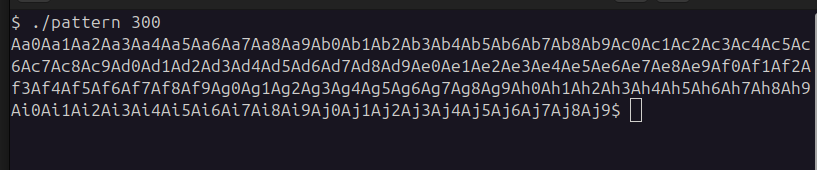
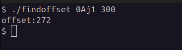

# PatternGenerator

PatternGenerator uygulaması bellek taşmalarını gözlemleyebilmek için patternler üretir. 

PatternGenerator tool purpose is creating patterns for finding overflow offsets in memory. 

## usage

  `./pattern [pattern size]`

  

  `./findoffset key pattern_size`

  
