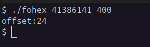

# PatternGenerator

PatternGenerator uygulaması bellek taşmalarını gözlemleyebilmek için patternler üretir ve taşan değeri hesaplayarak offseti bulmayı sağlar. 

PatternGenerator tool purpose is creating patterns for finding overflow offsets in memory and calculates offset. 

For compiling binary you can use   `gcc binary -w -o outputfile`

## usage

  `./pattern [pattern size]`

  

  `./findoffset key pattern_size`

  

  `./fohex hex_key pattern_size`

  

